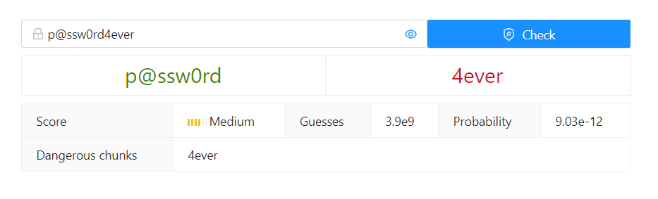

# Chunk-level Password Strength Meter
## 1. Chunk-level Password Strength Meter based on CKL_PCFG

### Introduction
CKL_PSM is a new password strength meter based on the chunk-level PCFG model (CKL_PCFG). Additionaly, CKL_PCFG employs BPE segmentation algorithm to segment passwords first, then apply the segmented passwords as a novel template to build the CKL_PCFG model. Overall, CKL_PCFG achieves state-of-the-art results on various password guessing scenarios. This CKL_PSM can remind users of vulnerable strings in a password.

For a detailed description or technical details and experimental results, please refer to our paper: Chunk-level Password Guessing: Towards Modeling Refined Password Composition Representations. 

### 1.1 Requirements  

- Python3.6 or Python3.8
- Node14.17 and yarn1.22 
- Ubuntu20.04 or Windows 10

### 1.2 Application startup  

#### 1.2.1 Back end  

```bash
cd backend
pip3 install -r requirements
python3 pcfg_server.py  # The default ip:port is <device local ip>:3001, and it MUSE BE <device local ip>:3001
```

#### 1.2.2 Front end  

```bash
cd frontend
yarn install
python3 ipconfig.py  # it is the same as: echo <device local ip> > ./src/ip.json
yarn build
yarn global add serve
~/.yarn/bin/serve build  # It will automatically choose a port
```

### 1.3 Preview  


